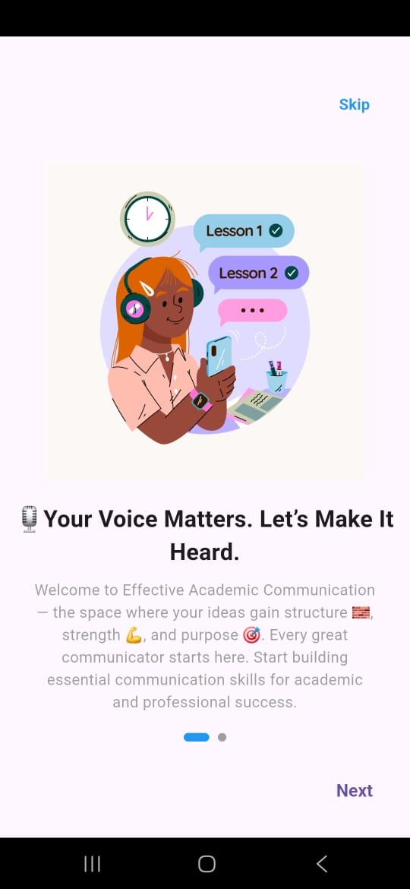
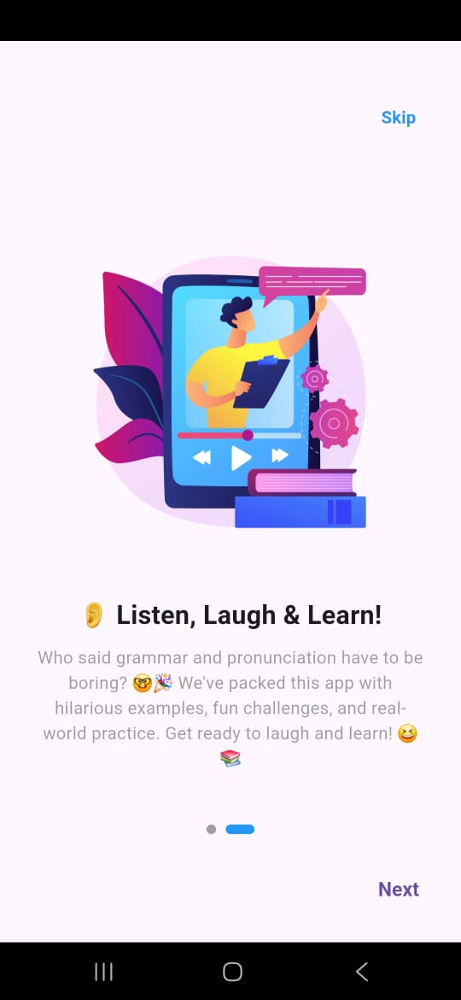

# 📘 EAC SLIIT

EAC SLIIT is a mobile application built to support **first-year and second-year students at SLIIT** who face challenges with English communication skills.  
This app provides an easy-to-use platform to **improve English abilities** while making learning more interactive and accessible.

---

## 👥 Collaboration
This project was developed in collaboration with one of my friends at **SLIIT**. Together, we aimed to create a meaningful solution for students who struggle with English during their early years at university.

---

## 🚀 Features
- 📝 Vocabulary and sentence-building support
- 🎧 Pronunciation guides for better speaking skills
- 📖 Learning modules tailored for Year 1 and Year 2 students
- 🏆 **Interactive activities** to practice reading, writing, and comprehension
    - Students can **submit their work through provided links**
- 🌐 Offline accessibility for uninterrupted learning (via GetStorage)
- 🔊 Audio support for students with **low reading efficiency**
- 📱 Simple and intuitive interface designed for students

---

## 🎯 Purpose
Many SLIIT students in their **first and second years** come from diverse educational backgrounds and often face **low English proficiency**.  
EAC SLIIT was built to help these students **bridge the language gap**, boosting confidence and improving communication skills in academic and professional settings.

---

## 📲 Availability
✅ **Already published on the Play Store!**  
You can download the app here:  
[👉 EAC SLIIT on Google Play](https://play.google.com/store/apps/details?id=com.effective.academicsliit)

---

## 🖼️ Screenshots

Here are some previews of the app in action:

  
  
  

---

## 🛠️ Tech Stack
- **Flutter** – Cross-platform mobile development
- **Dart** – Programming language
- **GetStorage** – Lightweight local storage for offline data persistence

---

## 📌 Future Enhancements
- AI-powered translation and speaking assistance
- Leaderboards and gamification to motivate learning
- Sinhala ↔ English sentence translation for better context understanding
- More interactive activities and quizzes

---

## 🙌 Acknowledgements
Special thanks to **SLIIT** and all the students who inspired us to build this application.  
This project is dedicated to helping our peers overcome language barriers and excel in their studies.  
